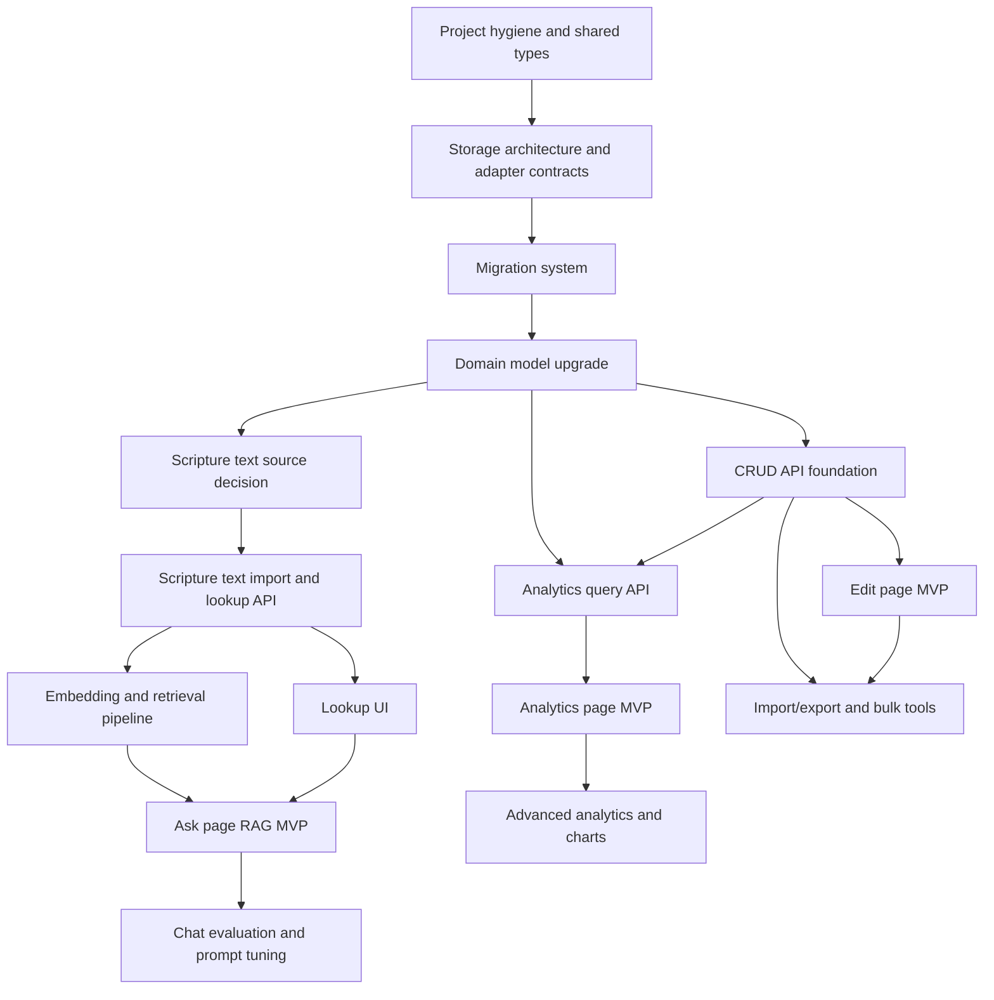

# Implementation DAG

This document describes the dependency graph for the requested feature set. The goal is to keep implementation work sequential where it must be sequential, and parallel where it can be parallel.

## High-Level Dependency Graph

## Critical Path

The critical path is:

1. Project hygiene and shared types.
2. Storage architecture and adapter contracts.
3. Migration system.
4. Domain model upgrade.
5. CRUD API foundation.
6. Edit page MVP.
7. Analytics query API and analytics page MVP.
8. Scripture text source, lookup API, embedding pipeline.
9. Ask page RAG MVP.

The edit page comes before analytics and ask because it defines the core occurrence data that analytics and RAG will rely on.

## Work That Can Happen In Parallel

After the domain model upgrade is designed:

- Frontend edit page wireframes can proceed while backend CRUD endpoints are implemented.
- Analytics query contract design can proceed while edit page UI work is underway.
- Scripture text source research can proceed in parallel with edit page work.
- Test fixture design can proceed alongside migration design.

After scripture text lookup exists:

- Lookup UI and RAG retrieval can be built independently.
- Analytics charts can be added while ask page prompt/retrieval work proceeds.

## Chunk Breakdown

### Chunk A: Project Hygiene

Dependencies: none.

Deliverables:

- Project-specific README.
- Shared domain constants for divine persons and standard works.
- Frontend API client helper.
- Backend error helper and route organization.
- Initial unit test and API test setup.

Acceptance checks:

- Existing record submission still works.
- `npm run build` succeeds.
- Existing API path behavior remains compatible or is intentionally redirected.

### Chunk B: Storage Architecture And Adapter Contracts

Dependencies: Chunk A.

Deliverables:

- Storage port interfaces for occurrence, reference, analytics, scripture lookup, and RAG metadata.
- MySQL adapter implementation that satisfies the ports.
- Contract test suite that future Web SQL/browser SQL and NoSQL adapters must pass.
- Storage provider configuration mechanism.
- Documentation for capabilities that vary by provider, such as transactions, full-text search, and aggregate query support.

Acceptance checks:

- API services import storage interfaces, not `mysql2`.
- MySQL-specific SQL is confined to MySQL adapter files.
- A fake in-memory adapter can run unit tests.
- Adding another adapter does not require rewriting page components or route handlers.

### Chunk C: Migration System

Dependencies: Chunk B.

Deliverables:

- Versioned migration files.
- Migration runner script.
- Test database reset strategy.
- Seed script for static data.

Acceptance checks:

- Fresh database can be created from migrations.
- Existing database can be migrated without data loss.
- Test database can be reset repeatably.
- MySQL-specific migrations are isolated from storage-neutral domain services.

### Chunk D: Domain Model Upgrade

Dependencies: Chunk C.

Deliverables:

- Revised schema for names per divine person.
- Canonical scripture hierarchy.
- Optional scripture text table.
- Audit timestamps.
- Indexes for search and analytics.

Acceptance checks:

- Same visible title can be recorded for more than one divine person.
- Duplicate occurrence prevention still works.
- Deleting occurrences maintains counts.
- Search queries have supporting indexes.

### Chunk E: CRUD API Foundation

Dependencies: Chunk D.

Deliverables:

- Create occurrence endpoint.
- List/search occurrences endpoint.
- Get occurrence endpoint.
- Update occurrence endpoint.
- Delete occurrence endpoint.
- Reference lookup endpoints for standard works, books, chapters, and verses.

Acceptance checks:

- API returns stable response shapes.
- Invalid references return clear validation errors.
- Delete and update operations preserve derived counts.
- Pagination is deterministic.

### Chunk F: Edit Page MVP

Dependencies: Chunk E.

Deliverables:

- `/edit` route.
- Create/edit form.
- Search/filter toolbar.
- Results table.
- Delete confirmation.
- Pagination.

Acceptance checks:

- User can create, search, edit, and delete entries without leaving the page.
- Form validation catches missing or malformed fields.
- List refreshes after changes.
- Duplicate occurrence errors are visible and recoverable.

### Chunk G: Analytics Query API

Dependencies: Chunk D and preferably Chunk E.

Deliverables:

- Aggregate names endpoint.
- Aggregate standard works/books endpoint.
- Aggregate chapters endpoint.
- Aggregate verses endpoint.
- Cross-filtered analytics endpoint.

Acceptance checks:

- Queries support most common and least common sorting.
- Filters can be combined.
- Empty result sets are explicit.
- Counts match occurrence table data.

### Chunk H: Analytics Page MVP

Dependencies: Chunk G.

Deliverables:

- `/analytics` route implementation.
- Filter controls.
- Sort controls.
- Summary cards.
- Tables for names, books, chapters, and verses.
- Drill-down from aggregate row to matching occurrences.

Acceptance checks:

- User can view all unique names sorted by count.
- User can view names per standard work, book, chapter, and verse.
- User can filter John and sort verses by names per verse.
- UI handles no-data cases gracefully.

### Chunk I: Scripture Text Source And Lookup

Dependencies: Chunk D.

Deliverables:

- Selected scripture text source.
- Import or connector implementation.
- Verse text table or file-backed lookup.
- Lookup API.
- Occurrence-to-verse detail API.

Acceptance checks:

- App can display verse text for an occurrence.
- Lookup works by standard work, book, chapter, and verse.
- Missing text is distinguishable from missing occurrence data.

### Chunk J: Ask/RAG MVP

Dependencies: Chunk I. It benefits from Chunk G.

Deliverables:

- Embedding pipeline.
- Retrieval store.
- Chat API.
- Prompt template with citation requirements.
- `/ask` route implementation.
- Source preview panel.

Acceptance checks:

- Answers cite retrieved verse references.
- User can ask about a name and see related verses.
- Retrieval includes both scripture text and recorded name metadata.
- The assistant says when the local corpus does not contain enough evidence.

## Suggested Sequence For The First Five Pull Requests

1. PR 1: Project README, shared constants/types, route naming decision.
2. PR 2: Storage ports, MySQL adapter wrapper, and memory adapter contract tests.
3. PR 3: Migration runner and baseline schema migration.
4. PR 4: Data model upgrade for names per divine person and canonical references.
5. PR 5: Occurrence CRUD APIs and edit page MVP.

## Dependency Notes

- Analytics can start before the edit page UI is perfect, but it should wait for the domain model upgrade.
- Ask/RAG should not start until scripture text lookup is solved. Without verse text, the RAG page can only discuss stored metadata, not actual scripture passages.
- Import/export can wait until edit CRUD works, but it should happen before a large manual data-entry push.
- Bulk edit should wait until single-row edit/delete is reliable.
