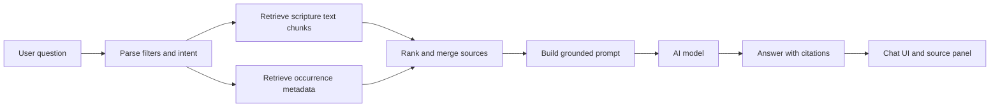

# Ask And RAG Page Plan

The ask page should let the user chat with AI about recorded divine names and the scripture passages where they appear. It should be grounded in local data, show sources, and avoid presenting unsupported claims as fact.

## Goals

- Chat with AI about names/titles and members of the Godhead.
- Retrieve relevant scripture passages.
- Retrieve recorded name occurrence metadata.
- Let users look up actual verses where names appear.
- Show source citations for answers.
- Support filters such as member, name, standard work, book, chapter, or verse.
- Fail clearly when the local data does not contain enough evidence.

## Non-Goals For MVP

- Do not answer from the entire internet.
- Do not hide source passages.
- Do not require deployment.
- Do not build fine-tuning.
- Do not assume the local database contains every possible scripture occurrence.

## Required Foundation

The ask page depends on:

- Canonical scripture references.
- Scripture text source.
- Lookup API.
- Occurrence list/query API.
- RAG document index.
- AI provider configuration.

Without scripture text, the ask page can only answer from stored names and references. That may be useful for a prototype, but it will not meet the requested "actual verses" goal.

## Scripture Text Source

Resolve this before implementing RAG.

Options:

### Option A: Import Public Or Licensed Text Into MySQL

Pros:

- Fast lookup.
- Easy joins with occurrence data.
- Fully local.

Cons:

- Requires confirming text rights/source.
- Increases database size.

### Option B: Store Scripture Text In Local Files

Pros:

- Easy to version and re-index.
- Keeps database focused on user data.

Cons:

- Joins require application logic.
- Need a clear file schema.

### Option C: Use External API

Pros:

- Less local import work.

Cons:

- Network dependency.
- May conflict with local-only project goal.
- API availability and licensing need review.

Recommendation:

- For a local-only study tool, prefer a local text source. Use MySQL if the main workflows need relational joins; use local files if licensing/source updates are easier that way.

## RAG Architecture

## Retrieval Corpus

Start with these document types:

### Verse Document

One document per verse.

Content:

- Reference label.
- Verse text.
- Standard work.
- Book.
- Chapter.
- Verse.
- Names recorded in that verse.

Best for:

- Direct verse lookup.
- Questions about where a name appears.
- Citation accuracy.

### Chapter Context Document

Optional after MVP.

Content:

- Chapter heading if available.
- All verse text in a chapter.
- Recorded names summarized by verse.

Best for:

- Contextual questions.
- Broader passages.

### Name Summary Document

Generated from occurrence data.

Content:

- Name/title.
- Divine person.
- Count.
- References where found.

Best for:

- "Which names are most common?"
- "Where is Redeemer found?"

## Embedding And Indexing Plan

### Index Build Flow

1. Load scripture text and occurrence metadata.
2. Build deterministic document content.
3. Compute content hash.
4. Skip unchanged documents.
5. Generate embeddings.
6. Store vector and metadata.
7. Record index build timestamp.

### Reindex Triggers

Reindex when:

- Scripture text changes.
- Occurrence data changes.
- Name/title is edited.
- Occurrence is deleted.
- Embedding model changes.

For MVP:

- Add a manual `npm run rag:reindex` script.
- Later add automatic incremental reindexing after occurrence mutations.

### Vector Store Options

Start simple because the app is local-only:

- File-backed vector index for MVP.
- SQLite vector extension if available and convenient.
- Dedicated vector DB only if the corpus or feature set grows.

If MySQL vector support is available locally, it can keep infrastructure simpler, but it should not block the first RAG prototype.

## Chat Behavior

### Prompt Requirements

The answer prompt should instruct the model to:

- Use only retrieved local sources.
- Cite references for claims about verses.
- Distinguish scripture text from user-entered occurrence metadata.
- Say when evidence is insufficient.
- Avoid inventing references.
- Preserve the user's selected filters.

### Source Requirements

Every answer should return:

- `answer`
- `sources`
- `retrievalMetadata`

Each source should include:

- reference label.
- verse ID or document ID.
- source type.
- excerpt.
- matched names, if any.

### Query Types To Support

MVP query types:

- "Where does the name X appear?"
- "What names for Jesus Christ appear in John?"
- "Which verses in 1 Nephi mention titles for Heavenly Father?"
- "Compare the names used for Jesus Christ in John and 1 Nephi."
- "Show me verses where the Holy Ghost is named."

Later query types:

- "What themes appear around these names?"
- "How does usage change by book?"
- "Find similar passages."

## Ask Page UI

Suggested layout:

- Left or top filter bar.
- Main chat panel.
- Source panel.
- Verse lookup panel or tab.

Controls:

- Member filter.
- Name filter.
- Standard work filter.
- Book filter.
- Clear filters.
- Ask input.
- Optional "retrieve only" debug toggle during development.

Source panel:

- Reference.
- Verse text excerpt.
- Names recorded in the verse.
- Open in lookup action.

## Lookup Experience

The ask page should include a lookup mode, or link to lookup from sources.

Lookup capabilities:

- Search by name/title.
- Search by member.
- Search by reference.
- Show all verses where a selected name appears.
- Show verse text and occurrence metadata.

This can reuse edit and analytics APIs:

- Occurrence list for metadata.
- Scripture lookup for text.
- Analytics drilldown for aggregate source rows.

## Backend Endpoints

### Chat

`POST /api/ask/chat`

Inputs:

- messages.
- filters.
- retrieval options.

Outputs:

- answer.
- sources.
- metadata.

### Retrieve

`POST /api/ask/retrieve`

Inputs:

- question.
- filters.
- max sources.

Outputs:

- ranked sources only.

### Reindex

For local development only:

`POST /api/ask/reindex`

This may be better as an npm script to avoid accidental expensive operations from the UI.

## Implementation Chunks

### Chunk 1: Scripture Text Decision

- Select text source.
- Document licensing/source.
- Define import format.

Acceptance:

- A developer can explain where verse text comes from and how to refresh it.

### Chunk 2: Scripture Lookup

- Store or load verse text.
- Add lookup API.
- Add source preview component.

Acceptance:

- User can view text for a recorded occurrence.

### Chunk 3: RAG Document Builder

- Generate verse documents.
- Attach occurrence metadata.
- Store document hashes.

Acceptance:

- Running the builder produces deterministic documents.

### Chunk 4: Embedding Pipeline

- Add embedding provider config.
- Generate embeddings.
- Store vectors and metadata.
- Add retrieve-only endpoint.

Acceptance:

- A test question returns plausible source verses without chat generation.

### Chunk 5: Chat API

- Add prompt builder.
- Add model call.
- Return answer plus citations.

Acceptance:

- Answers cite source references.
- Insufficient data response is clear.

### Chunk 6: Ask Page UI

- Build chat interface.
- Add filters.
- Add source panel.
- Add lookup links.

Acceptance:

- User can ask about a name and inspect cited verses.

### Chunk 7: Evaluation And Tuning

- Add a small question set.
- Record expected source references.
- Test retrieval quality.

Acceptance:

- Known questions retrieve expected sources.

## Privacy And Configuration

Because the project runs locally:

- Keep API keys out of source control.
- Use environment variables or local config files ignored by git.
- Show a clear error when AI configuration is missing.
- Do not send user database dumps to AI. Send only retrieved snippets needed for the answer.

## Failure Modes

Handle:

- No AI key configured.
- No scripture text imported.
- No embeddings built.
- Retrieval returns no sources.
- Model returns an answer without citations.
- Source document no longer exists after an edit/delete.

## Acceptance Criteria For Ask MVP

- User can ask a question about a name/title.
- System retrieves local scripture sources.
- System includes recorded occurrence metadata when relevant.
- Answer cites scripture references.
- User can open cited sources and see verse text.
- System does not fabricate references when data is missing.

