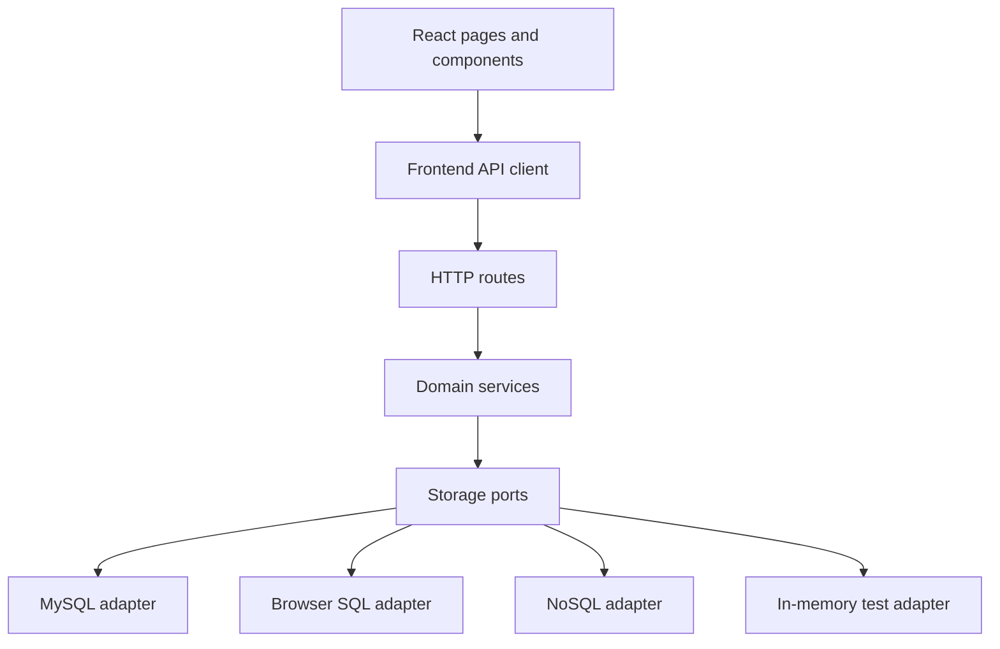

# Storage Architecture And Dependencies

This project should be able to move between MySQL, browser-local SQL, and a different NoSQL database without rewriting the React pages or product logic. The way to make that practical is to use a ports-and-adapters architecture around persistence.

## Architecture Goal

The app should depend on domain capabilities, not database products.

Database-specific details should be isolated to adapters:

- MySQL SQL syntax.
- Browser SQL connection lifecycle.
- NoSQL document shape.
- Migration tooling.
- Transaction semantics.
- Index definitions.
- Full-text or vector search implementations.

Everything above the storage adapter should use stable TypeScript interfaces and storage-neutral domain records.

## Important Note About Web SQL

"Web SQL" can mean two different things:

- The legacy browser Web SQL API.
- A browser-local SQL database experience, often implemented today with SQLite compiled to WebAssembly and persisted through IndexedDB or the Origin Private File System.

The legacy Web SQL API is not a good long-term target. If the goal is "SQL in the browser", plan for a `BrowserSqlStorage` adapter that can be implemented with a modern browser-local SQL engine. Keep the interface generic enough that a legacy Web SQL proof of concept could exist, but do not let the product architecture depend on Web SQL-specific APIs.

## Dependency Rule

Use this rule everywhere:

```text
UI and services depend inward on interfaces.
Database packages depend outward as replaceable adapters.
```

Allowed dependencies:

- React components can depend on frontend API client types.
- Route handlers can depend on services.
- Services can depend on storage port interfaces.
- Storage adapters can depend on database drivers.

Disallowed dependencies:

- React components importing `mysql2`.
- Services containing SQL strings.
- Route handlers constructing SQL queries.
- Analytics UI depending on a MySQL-specific response shape.
- RAG code directly reading relational tables instead of using scripture and occurrence stores.

## Proposed Layers



## Storage Provider Interface

Define a single storage provider that composes smaller stores.

```ts
export type StorageProvider = {
  occurrences: OccurrenceStore
  references: ReferenceStore
  analytics: AnalyticsStore
  scripture: ScriptureStore
  rag: RagStore
  transactions: TransactionRunner
  capabilities: StorageCapabilities
}
```

### Occurrence Store

```ts
export type OccurrenceStore = {
  create(input: CreateOccurrenceInput): Promise<OccurrenceRow>
  list(query: OccurrenceListQuery): Promise<PaginatedResult<OccurrenceRow>>
  getById(id: string): Promise<OccurrenceRow | null>
  update(id: string, input: UpdateOccurrenceInput): Promise<OccurrenceRow>
  delete(id: string): Promise<void>
}
```

### Reference Store

```ts
export type ReferenceStore = {
  listDivinePersons(): Promise<DivinePerson[]>
  listStandardWorks(): Promise<StandardWork[]>
  listBooks(query: BookQuery): Promise<ScriptureBook[]>
  resolveReference(input: ResolveReferenceInput): Promise<ResolvedReference>
}
```

### Analytics Store

```ts
export type AnalyticsStore = {
  getSummary(filters: AnalyticsFilters): Promise<AnalyticsSummary>
  groupNames(query: AnalyticsQuery): Promise<PaginatedResult<NameAggregateRow>>
  groupLocations(query: LocationAnalyticsQuery): Promise<PaginatedResult<LocationAggregateRow>>
  drilldown(query: AnalyticsDrilldownQuery): Promise<PaginatedResult<OccurrenceRow>>
}
```

### Scripture Store

```ts
export type ScriptureStore = {
  lookupVerse(reference: VerseLookup): Promise<ScriptureVerse | null>
  getVerseById(id: string): Promise<ScriptureVerse | null>
  listVerses(query: VerseQuery): Promise<PaginatedResult<ScriptureVerse>>
}
```

### RAG Store

```ts
export type RagStore = {
  upsertDocuments(documents: RagDocumentInput[]): Promise<void>
  markVerseStale(verseId: string): Promise<void>
  markDeleted(documentIds: string[]): Promise<void>
  retrieve(query: RetrievalQuery): Promise<RetrievedDocument[]>
  getIndexStatus(): Promise<RagIndexStatus>
}
```

## Storage Capabilities

Not every database supports the same features. Expose capabilities explicitly:

```ts
export type StorageCapabilities = {
  transactions: "full" | "limited" | "none"
  relationalJoins: boolean
  fullTextSearch: boolean
  vectorSearch: boolean
  cascadeDeletes: boolean
  uniqueConstraints: boolean
  offlineBrowserPersistence: boolean
}
```

Services can use these capabilities to choose safe behavior. For example, if an adapter has no native unique constraint, the occurrence service should perform conflict checks and the adapter should still provide an atomic or best-effort conflict guard.

## Provider Configuration

Use a single storage selection point.

Example environment values:

```text
STORAGE_PROVIDER=mysql
STORAGE_PROVIDER=browser-sql
STORAGE_PROVIDER=nosql
STORAGE_PROVIDER=memory
```

Server factory:

```ts
export async function createStorageProvider(config: AppConfig): Promise<StorageProvider> {
  if (config.storageProvider === "mysql") {
    return createMySqlStorage(config.mysql)
  }
  if (config.storageProvider === "browser-sql") {
    return createBrowserSqlStorage(config.browserSql)
  }
  if (config.storageProvider === "nosql") {
    return createNoSqlStorage(config.noSql)
  }
  return createMemoryStorage()
}
```

For browser-local SQL, the architecture may need a client-side storage provider instead of server-side Vite middleware. Keep API client calls behind a data access layer so the app can run in either mode:

- Server mode: React calls `/api/...`, server uses storage provider.
- Local browser mode: React calls a client-side repository that uses `BrowserSqlStorage`.

## Query Objects Instead Of SQL Leakage

Define query objects that can be implemented by any adapter.

```ts
export type OccurrenceListQuery = {
  search?: string
  divinePersonId?: string
  standardWorkId?: string
  bookId?: string
  chapter?: number
  verse?: number
  sort: "reference_asc" | "reference_desc" | "name_asc" | "name_desc" | "created_desc" | "created_asc"
  page: number
  pageSize: number
}
```

Adapters translate query objects:

- MySQL: SQL with joins, indexes, `LIMIT`, and `OFFSET`.
- Browser SQL: local SQL query.
- NoSQL: document query, secondary indexes, aggregation pipeline, or precomputed projection.

The UI should never construct SQL-like strings.

## Data Modeling Across Providers

### MySQL

Best fit:

- Normalized scripture hierarchy.
- Relational joins.
- Aggregate analytics.
- Transactional create/update/delete.

Implementation:

- Keep normalized tables.
- Use migrations.
- Add indexes for filters and groupings.
- Keep SQL in adapter files.

### Browser SQL

Best fit:

- Local-only offline use.
- Smaller personal datasets.
- Similar schema to MySQL without a server.

Implementation:

- Reuse the logical schema where possible.
- Add import/export because browser storage can be cleared by users or browser settings.
- Avoid relying on MySQL-only syntax.
- Keep schema migrations separate from MySQL migrations.

Architecture caveat:

- Browser SQL runs in the browser, not in the Node Vite middleware. Supporting it cleanly may require a frontend repository path in addition to HTTP API calls.

### NoSQL

Best fit:

- Flexible documents.
- Denormalized read models.
- Cloud sync later, if desired.

Possible document shapes:

```ts
type OccurrenceDocument = {
  id: string
  nameTitle: {
    id: string
    name: string
    normalizedName: string
    divinePersonId: string
    divinePersonName: string
  }
  verse: {
    id: string
    standardWorkId: string
    standardWorkName: string
    bookId: string
    bookName: string
    chapter: number
    verse: number
    reference: string
  }
  notes?: string
  createdAt: string
  updatedAt: string
}
```

NoSQL adapter responsibilities:

- Enforce duplicate occurrence rules.
- Maintain denormalized display fields.
- Provide aggregate queries or precomputed aggregate collections.
- Handle consistency after edits/deletes.

## Analytics Portability

Analytics is the feature most likely to expose database differences. Keep it portable by making the API ask for grouped results, not SQL behavior.

Good:

```ts
analytics.groupLocations({ groupBy: "verse", filters, sort: "count_desc" })
```

Bad:

```ts
analytics.query("SELECT ... GROUP BY verse_id ORDER BY COUNT(*) DESC")
```

For NoSQL, consider precomputed projections:

- `name_counts`
- `location_counts`
- `verse_name_counts`

The NoSQL adapter can update projections during occurrence mutations or rebuild them with a background script.

## Transactions And Consistency

Create/update/delete occurrence operations affect:

- occurrence row/document.
- name/title row/document.
- cached counts or aggregate projections.
- RAG document metadata.

MySQL can handle this with transactions. Other providers may need different patterns.

Recommended service-level pattern:

```ts
await storage.transactions.run(async (tx) => {
  const occurrence = await tx.occurrences.create(input)
  await tx.rag.markVerseStale(occurrence.verseId)
  return occurrence
})
```

If an adapter cannot provide full transactions:

- It must document the limitation through `StorageCapabilities`.
- Services should favor idempotent operations.
- Add repair scripts for counts and RAG index state.

## ID Strategy

Use string IDs in public APIs and domain services.

Adapter choices:

- MySQL can convert integer IDs to strings at the boundary.
- Browser SQL can use UUIDs or generated string IDs.
- NoSQL can use native document IDs.

Do not expose auto-increment assumptions to frontend code.

## Migration Strategy Across Providers

Use provider-specific migrations:

```text
server/storage/mysql/migrations/
server/storage/browser-sql/migrations/
server/storage/nosql/migrations/
```

Storage-neutral migration rules:

- Domain changes should be documented once.
- Each adapter maps the change to its own migration format.
- Contract tests verify all adapters expose the same behavior after migration.

## Adapter Contract Tests

Every storage adapter should pass the same behavior suite.

Test cases:

- Create occurrence.
- Reject duplicate occurrence.
- Allow same visible name for different divine persons.
- List with filters.
- Update name and reference.
- Delete occurrence.
- Count occurrences by name.
- Count occurrences by book.
- Resolve references.
- Lookup verse text.
- Retrieve RAG documents, if adapter claims vector support.

Contract tests should run against:

- Memory adapter on every test run.
- MySQL adapter when test database is configured.
- Browser SQL adapter in browser/e2e tests.
- NoSQL adapter when configured.

## Dependency Management

Keep database drivers optional at the adapter layer where possible.

Current dependency:

- `mysql2`

Future dependency examples:

- Browser SQL engine package.
- NoSQL client package.
- Vector search package.

Guidelines:

- Do not import optional provider packages from shared modules.
- Keep provider initialization dynamic.
- Fail with clear setup errors if selected provider dependencies are missing.
- Keep AI provider dependencies separate from core storage dependencies.

## Implementation Chunks

### Chunk 1: Define Ports And Domain Types

- Add storage-neutral domain records.
- Add store interfaces.
- Add query/filter types.

Acceptance:

- Services can be typed without importing database drivers.

### Chunk 2: Wrap Current MySQL Code In Adapter

- Move current SQL into MySQL repository files.
- Keep current endpoint behavior.
- Add `createMySqlStorage`.

Acceptance:

- Existing submission flow still works.
- `mysql2` imports are isolated.

### Chunk 3: Add Memory Adapter And Contract Tests

- Implement in-memory storage for tests.
- Add contract suite.

Acceptance:

- Service tests run without MySQL.
- Contract tests define expected behavior for future adapters.

### Chunk 4: Add Adapter Selection

- Add config loader.
- Add `STORAGE_PROVIDER`.
- Default to MySQL for current app.

Acceptance:

- App starts with MySQL by default.
- Tests can run with memory provider.

### Chunk 5: Prepare Browser SQL Adapter

- Decide specific browser-local SQL technology.
- Implement schema/migrations.
- Add frontend data access path if running without server.

Acceptance:

- A local browser storage proof of concept can create/list occurrences through the same domain API.

### Chunk 6: Prepare NoSQL Adapter

- Choose NoSQL target.
- Design document model and aggregate projections.
- Implement adapter behind the same ports.

Acceptance:

- NoSQL adapter passes the same contract tests.

## Practical Recommendation

Do not try to implement three databases at once. Build the architecture now so switching is possible later:

1. Define storage ports.
2. Wrap MySQL as the first adapter.
3. Add memory adapter for tests.
4. Add contract tests.
5. Only then add browser SQL or NoSQL.

This keeps the current app moving while preventing MySQL-specific decisions from spreading through the codebase.
